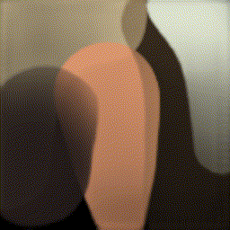
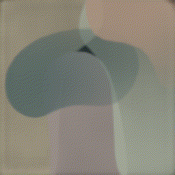
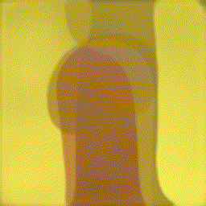
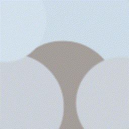
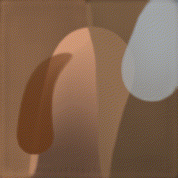
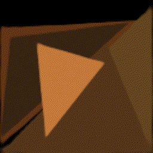
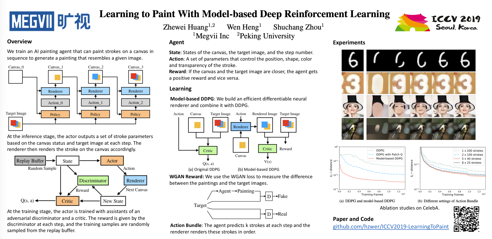

# ICCV2019-Learning to Paint

## [Arxiv](https://arxiv.org/abs/1903.04411) | [YouTube](https://youtu.be/YmOgKZ5oipk) | [Reddit](https://www.reddit.com/r/reinforcementlearning/comments/b5lpfl/learning_to_paint_with_modelbased_deep/)

## Abstract

We show how to teach machines to paint like human painters, who can use a
small number of strokes to create fantastic paintings. By employing a neural
renderer in model-based Deep Reinforcement Learning (DRL), our agents learn to
determine the position and color of each stroke and make long-term plans to
decompose texture-rich images into strokes. Experiments demonstrate that
excellent visual effects can be achieved using hundreds of strokes. The
training process does not require the experience of human painters or stroke
tracking data. 

**You can easily use [colaboratory](https://colab.research.google.com/github/hzwer/LearningToPaint/blob/master/LearningToPaint.ipynb) to have a try.**




* Our ICCV poster
  <div>
  
  </div>


## Installation
Use [anaconda](https://conda.io/miniconda.html) to manage environment

```
$ conda create -n py36 python=3.6
$ source activate py36
$ git clone https://github.com/hzwer/LearningToPaint.git
$ cd LearningToPaint
```

### Dependencies
* [PyTorch](http://pytorch.org/) 0.4.1 
* [tensorboardX](https://github.com/lanpa/tensorboard-pytorch/tree/master/tensorboardX)
* [opencv-python](https://pypi.org/project/opencv-python/) 3.4.0
```
pip3 install torch==1.1.0
pip3 install tensorboardX
pip3 install opencv-python
```

## Testing
Make sure there are renderer.pkl and actor.pkl before testing.

You can download a trained neural renderer and a CelebA actor for test: [renderer.pkl](https://drive.google.com/open?id=1-7dVdjCIZIxh8hHJnGTK-RA1-jL1tor4) and [actor.pkl](https://drive.google.com/open?id=1a3vpKgjCVXHON4P7wodqhCgCMPgg1KeR)

```
$ wget "https://drive.google.com/uc?export=download&id=1-7dVdjCIZIxh8hHJnGTK-RA1-jL1tor4" -O renderer.pkl
$ wget "https://drive.google.com/uc?export=download&id=1a3vpKgjCVXHON4P7wodqhCgCMPgg1KeR" -O actor.pkl
$ python3 baseline/test.py --max_step=100 --actor=actor.pkl --renderer=renderer.pkl --img=image/test.png --divide=4
$ ffmpeg -r 10 -f image2 -i output/generated%d.png -s 512x512 -c:v libx264 -pix_fmt yuv420p video.mp4 -q:v 0 -q:a 0
(make a painting process video)
```

We also provide with some other neural renderers and agents, you can use them instead of renderer.pkl to train the agent:

[triangle.pkl](https://drive.google.com/open?id=1YefdnTuKlvowCCo1zxHTwVJ2GlBme_eE) --- [actor_triangle.pkl](https://drive.google.com/open?id=1k8cgh3tF7hKFk-IOZrgsUwlTVE3CbcPF);

[round.pkl](https://drive.google.com/open?id=1kI4yXQ7IrNTfjFs2VL7IBBL_JJwkW6rl) --- [actor_round.pkl](https://drive.google.com/open?id=1ewDErUhPeGsEcH8E5a2QAcUBECeaUTZe);

[bezierwotrans.pkl](https://drive.google.com/open?id=1XUdti00mPRh1-1iU66Uqg4qyMKk4OL19) --- [actor_notrans.pkl](https://drive.google.com/open?id=1VBtesw2rHmYu2AeJ22XvTCuzuqkY8hZh)

We also provide 百度网盘 source. 链接: https://pan.baidu.com/s/1GELBQCeYojPOBZIwGOKNmA 提取码: aq8n 
## Training

### Datasets
Download the [CelebA](http://mmlab.ie.cuhk.edu.hk/projects/CelebA.html) dataset and put the aligned images in data/img_align_celeba/\*\*\*\*\*\*.jpg

### Neural Renderer
To create a differentiable painting environment, we need train the neural renderer firstly. 

```
$ python3 baseline/train_renderer.py
$ tensorboard --logdir train_log --port=6006
(The training process will be shown at http://127.0.0.1:6006)
```

### Paint Agent
After the neural renderer looks good enough, we can begin training the agent.
```
$ cd baseline
$ python3 train.py --max_step=40 --debug --batch_size=96
(A step contains 5 strokes in default.)
$ tensorboard --logdir train_log --port=6006
```

## FAQ
**Why does your demo look better than the result in your paper?**

In our demo, after painting the outline of each image, we divide it into small patches to paint parallelly to get a high resolution.

**Your main difference from [primitive](https://github.com/fogleman/primitive)？**

Our research is to explore how to make machines learn to use painting tools. Our implementation is a combination of reinforcement learning and computer vision. Please read our paper for more details.

## Resources
- Chinese introductions

[大三少年造出AI写意画家，像人类一样挥笔作画](https://zhuanlan.zhihu.com/p/64097633)

[Learning to Paint：一个绘画 AI](https://zhuanlan.zhihu.com/p/61761901)

[旷视研究院推出基于深度强化学习的绘画智能体](https://zhuanlan.zhihu.com/p/80732065)

## Contributors
- [hzwer](https://github.com/hzwer)
- [ak9250](https://github.com/ak9250)

Also many thanks to [ctmakro](https://github.com/ctmakro/rl-painter) for inspiring this work. He also explored using greedy algorithm to generate paintings - [opencv_playground](https://github.com/ctmakro/opencv_playground).

If you find this repository useful for your research, please cite the following paper:
```
@article{huang2019learning,
  title={Learning to Paint with Model-based Deep Reinforcement Learning},
  author={Huang, Zhewei and Heng, Wen and Zhou, Shuchang},
  journal={arXiv preprint arXiv:1903.04411},
  year={2019}
}
```
