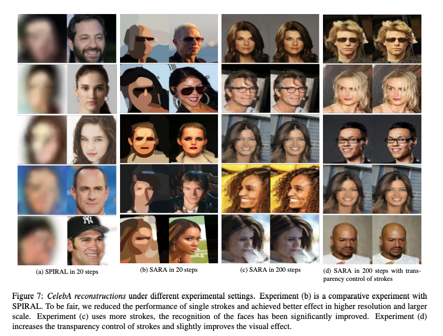

# Neural Stroke-based Rendering


## Abstract

Excellent painters can use only a few strokes to create a fantastic painting, which is a symbol of human inte and art. Reversing the simulator to interpret images is also a challenging task of computer vision in recent years. In this paper, we propose a stroke-based rendering (SBR) method that combines the neural stroke renderer (NSR) and deep reinforcement learning (DRL), allowing the machine to learn the ability of deconstructing images using strokes and create amazing visual effects. Our agent is an end-to-end program that converts natural images into paintings. The training process does not require human painting experience or stroke tracking data. 

## Installation
Use [anaconda](https://conda.io/miniconda.html) to manage environment

```
$ conda create -n py36 python=3.6
$ source activate py36
```

### Dependencies
* [PyTorch](http://pytorch.org/) 0.4 
* [tensorboardX](https://github.com/lanpa/tensorboard-pytorch/tree/master/tensorboardX)
* [opencv-python](https://pypi.org/project/opencv-python/)

### Data
Download the CelebA(http://mmlab.ie.cuhk.edu.hk/projects/CelebA.html) dataset and put the aligned images in data/img_align_celeba/******.jpg

## Training

### Neural Renderer
To create a differentiable painting environment, we need train the neural renderer firstly. 

```
$ python3 train_bezier.py
$ tensorboard --logdir ../train_log --port=6006
(The training process will be shown at http://127.0.0.1:6006)
```

### RL Agent
After the neural renderer looks good enough, we can begin training the agent.
```
$ python3 train.py --max_step=40
(A step contains 5 strokes in default.)
$ tensorboard --logdir ../train_log --port=6006
```

We will provide you some trained parameters soon. We really hope someone will use these code to reproduce the results.
## Results




## Reference
Our paper will be released soon.
