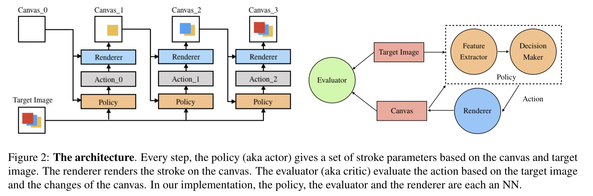
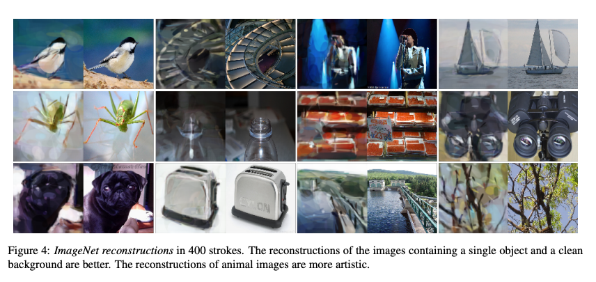

# Stroke-based Artistic Rendering Agent with Deep Reinforcement Learning

---> https://arxiv.org/abs/1903.04411

---> [Reddit](https://www.reddit.com/r/computervision/comments/b01ksx/strokebased_artistic_rendering_agent_with_deep/) Welcome to suggest our work!

<div align=center>
  



</div>

## Abstract

Excellent painters can use only a few strokes to create a fantastic painting, which is a symbol of human intelligence and art. Inverting a renderer or generator to interpret images is also a challenging task of computer vision in recent years. In this paper, we present SARA, a stroke-based artistic rendering agent that combines the neural renderer and deep reinforcement learning (DRL), allowing the machine to learn the ability to deconstruct images using strokes and create amazing visual effects. Our agent is an end-to-end program that converts natural images into paintings. The training process does not require the experience of human painting or stroke tracking data.

## Installation
Use [anaconda](https://conda.io/miniconda.html) to manage environment

```
$ conda create -n py36 python=3.6
$ source activate py36
```

### Dependencies
* [PyTorch](http://pytorch.org/) 0.4 
* [tensorboardX](https://github.com/lanpa/tensorboard-pytorch/tree/master/tensorboardX)
* [opencv-python](https://pypi.org/project/opencv-python/)

### Datasets
Download the [CelebA](http://mmlab.ie.cuhk.edu.hk/projects/CelebA.html) dataset and put the aligned images in data/img_align_celeba/\*\*\*\*\*\*.jpg

## Training

### Neural Renderer
To create a differentiable painting environment, we need train the neural renderer firstly. 

```
$ python3 baseline/train_renderer.py
$ tensorboard --logdir ./train_log --port=6006
(The training process will be shown at http://127.0.0.1:6006)
```

### RL Agent
After the neural renderer looks good enough, we can begin training the agent.
```
$ python3 baseline/train.py --max_step=40
(A step contains 5 strokes in default.)
$ tensorboard --logdir ./train_log --port=6006
```

We will provide you some trained parameters soon. We really hope someone will use these code to reproduce the results.
## Results



If you find this repository useful for your research, please cite the following paper :

```
@article{huang2019stroke,
  title={Stroke-based Artistic Rendering Agent with Deep Reinforcement Learning
},
  author={Huang, Zhewei and Heng, Wen and Zhou, Shuchang},
  journal={arXiv preprint arXiv:1903.04411},
  year={2019}
}
```
